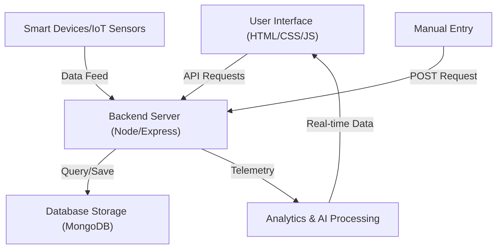

# NexGen Energy AI | Working Model & Process

This document outlines the operational workflow and architectural process of the NexGen Energy AI ecosystem.

---

## 🏗 System Architecture Flow

---

## 🚀 1. User Interaction & Dashboard Initialization
When a user accesses the ecosystem:
- **Frontend Hydration**: The browser loads the premium Glassmorphism UI (HTML/CSS).
- **Dynamic Connection**: The system connects to the Node.js backend via REST APIs and WebSocket (Socket.io).
- **Grid Telemetry**: Energy data is fetched dynamically from MongoDB.
- **Neural Visualization**: Real-time charts (ApexCharts) and counters are initialized to display live metrics.

## 📡 2. Multi-Channel Data Collection
The application aggregates energy telemetry from multiple streams:
- **IoT Sensors**: Real-time feeds from smart hardware.
- **Manual Input**: User-driven data points via the "Add Data" portal.
- **Database History**: Historical logs retrieved from MongoDB.
- **Calculated Metrics**: AC usage, refrigerator consumption, and overall household load.

## ⚙️ 3. Backend Logic & Processing
The Express server acts as the central brain, performing:
- **Aggregation**: Calculating total kWh consumed over specific durations.
- **Trend Analysis**: Measuring hourly, daily, and monthly usage deltas.
- **Anomaly Detection**: Identifying unusual spikes or "vampire loads" in the grid.
- **Cost Estimation**: Converting kWh usage into real-time currency (₹) estimates.

## 📊 4. Real-Time Analytics Dashboard
Telemetry is visualized through specialized components:
- **Live Consumption Card**: Displays real-time kW usage with pulse animations.
- **Historical Trends**: Weekly and monthly area charts showing usage patterns.
- **Device-Specific Monitoring**: Breakdown of consumption for AC, Lighting, and HVAC.

## 🤖 5. AI Neural Recommendation System
The built-in AI module analyzes behavioral patterns to generate efficiency tips:
- **Idle Load Alerts**: Suggestions to unplug devices in unused rooms.
- **Schedule Optimization**: Advice on AC temperature adjustments for cost savings.
- **Efficiency Scoring**: A dynamic percentage based on green energy usage habits.

## 💰 6. Predictive Bill Estimation
The system uses historical data and current consumption velocity to forecast expenses:
- **Rate Mapping**: Applying regional electricity unit rates.
- **Velocity Tracking**: Predicting the end-of-month bill based on current growth.
- **Budget Alerts**: Notifying users when they approach their set energy cap.

## ⚠️ 7. Smart Alerts & Grid Safety
Automated safety checks run in the background to detect:
- **Power Spikes**: Sudden surges that could indicate faulty appliances.
- **Nighttime Leakage**: Identifying high consumption during sleeping hours.
- **HVAC Overload**: Monitoring AC efficiency levels.

## 🌍 8. Carbon Footprint & Sustainability
Promotion of eco-friendly energy habits by tracking:
- **CO₂ Emissions**: Calculating the carbon equivalent of energy used.
- **Eco Score**: A gamified metric to encourage sustainable consumption.
- **Environmental Impact**: Visualizing energy savings as "trees saved."

---

## 🛠 Technology Stack (Verified)

| Layer | Technology |
| :--- | :--- |
| **Frontend** | Vanilla JavaScript (ES6+), HTML5, CSS3 (Glassmorphism) |
| **Charts** | ApexCharts.js |
| **Backend** | Node.js, Express.js |
| **Database** | MongoDB (Mongoose) |
| **Real-time** | Socket.io |
| **Animations** | Animate.css, Particles.js |
| **Deployment** | Render / GitHub |

---
*Developed for the AI Energy Optimization Initiative.*
