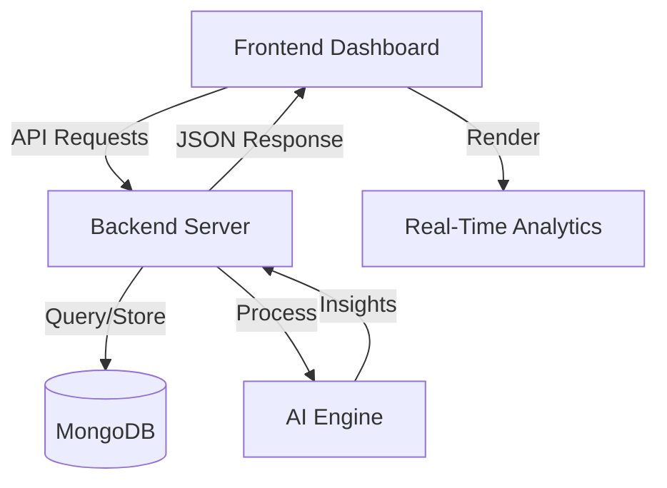

# NexGen Energy AI - Smart Usage Tracker

A professional, futuristic AI-powered energy dashboard built with Vanilla JS, Node.js, and MongoDB.

## 🚀 Features
- **Real-Time Monitoring**: Track live energy consumption with interactive charts.
- **AI Neural Engine**: Automated analysis of usage patterns and abnormality detection.
- **Predictive Analytics**: Forecast future consumption and costs using AI models.
- **Smart Device Control**: Manage IoT devices directly from the dashboard.
- **Glassmorphism UI**: High-end futuristic design with dark/light mode and smooth animations.

## 📂 Project Structure
```
/project
├── /frontend           # Elite Client Interface
│   ├── index.html      # Authentication Portal
│   ├── dashboard.html  # Main Ecosystem View
│   ├── analytics.html  # Prediction & History
│   ├── devices.html    # IoT Control Center
│   ├── settings.html   # System Configuration
│   ├── style.css       # Design System
│   └── app.js          # Client Logic Engine
│
├── /server             # Backend Infrastructure
│   ├── server.js       # Express Server & API
│   ├── models/         # MongoDB Schemas
│   ├── routes/         # API Gateways
│   └── config/         # Database Connection
│
├── package.json        # Dependencies
└── README.md           # Documentation
```

## 🛠 Tech Stack
- **Frontend**: HTML5, CSS3, Vanilla JavaScript (ES6)
- **Charts**: ApexCharts, Chart.js
- **Animations**: Animate.css, Particles.js
- **Backend**: Node.js, Express.js
- **Database**: MongoDB (via Mongoose)
- **Real-time**: Socket.io

## 🔄 Working Process

### 1. User Interaction & Dashboard Initialization
When a user visits the portal:
- The **Frontend** loads the premium glassmorphism UI.
- The **Client Logic Engine (`app.js`)** establishes connections to backend APIs.
- Energy telemetry is fetched dynamically and visualized through **ApexCharts** in real-time.

### 2. Data Acquisition Pipeline
The system aggregates data from multiple vectors:
- **Smart Devices & IoT Sensors**: Real-time power draw metrics.
- **Manual User Input**: Historical data points entered via the modal.
- **API Simulation**: Live weather and grid pricing data.
- **Database Records**: Historical consumption logs stored in **MongoDB**.

### 3. Backend Intelligence Layer
The **Node.js** server processes raw telemetry to generate actionable insights:
- **Total Consumption**: Aggregating usage across all circuits.
- **Trend Analysis**: Comparing current usage against daily/monthly averages.
- **Anomaly Detection**: Identifying power spikes or "vampire loads".

### 4. Real-Time Visualization
The dashboard translates complex data into simple visuals:
- **Live Meter**: Displays instantaneous power draw in kW.
- **Efficiency Heatmaps**: Shows when the home is most/least eco-friendly.
- **Device Breakdown**: Categorizes usage by AC, Lighting, HVAC, etc.

### 5. AI Recommendation Engine
The AI module analyzes behavior patterns to suggest optimizations:
- **Smart Scheduling**: Suggesting off-peak usage for heavy appliances.
- **Vampire Load Alerts**: Notifying users to unplug idle chargers.
- **Eco-Mode**: Automated suggestions to reduce carbon footprint.

### 6. Financial & Environmental Impact
- **Bill Prediction**: Estimating the monthly cost based on current velocity and local tariffs.
- **Carbon Tracking**: Calculating the CO₂ impact of energy consumed.

### 7. Technical Architecture Flow


## 🚦 Getting Started
1. Install dependencies: `npm install`
2. Start the server: `npm start`
3. Access dashboard: `http://localhost:5000`

## 📡 API Endpoints
- `GET /api/energy`: Fetch current grid status.
- `POST /api/usage`: Log new telemetry data.
- `GET /api/predictions`: Retrieve AI forecast models.
- `GET /api/alerts`: Get abnormal usage notifications.

---
Built for the **AI Project Showcase**. Developed by **Aman Verma**.
